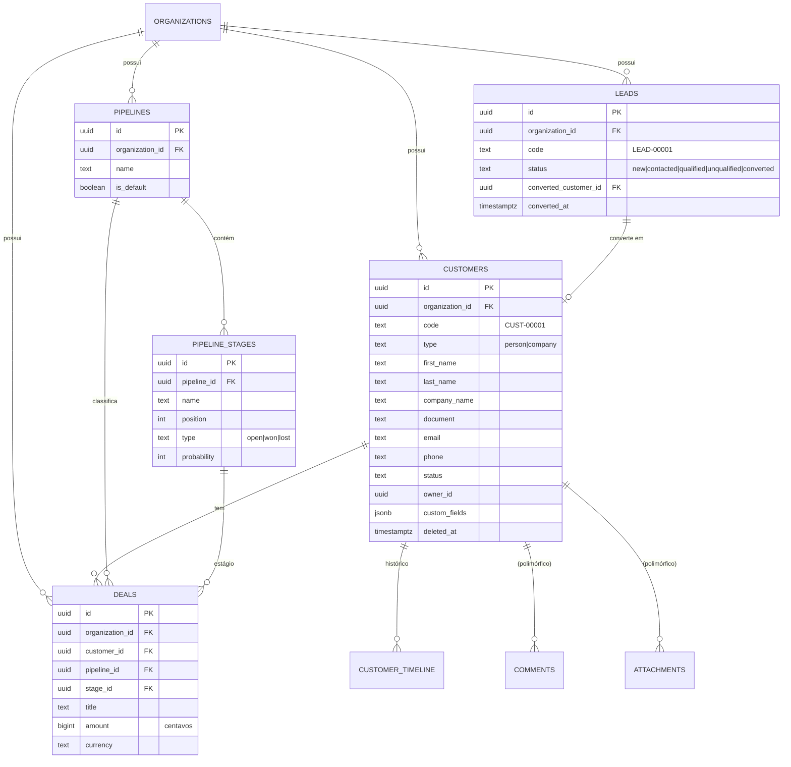

# Banco de Dados — ConnectWeb Automations

PostgreSQL (Supabase). **Multiempresa com isolamento total via Row Level
Security (RLS)** sobre `organization_id`.

> Este documento é o desenho de referência. As migrações reais são criadas na
> Fase F1 em `supabase/migrations/`. O arquivo `0001_init.sql` já contém a
> fundação (organizations + memberships + RLS) como base **não aplicada**.

## Princípios de tenancy

1. Toda tabela de negócio tem `organization_id uuid not null references
   organizations(id)`.
2. RLS habilitado em todas elas; políticas permitem a linha apenas se o usuário
   autenticado pertence àquela organização.
3. Helper `public.is_member_of(org uuid)` centraliza a checagem.
4. A organização ativa é derivada da sessão no servidor — o cliente nunca envia
   `organization_id` confiável.

## Entidades (espelham `src/types/domain.ts`)

### Identidade
- **organizations** — `id, name, slug, plan_id, enabled_modules[], timestamps`.
- **profiles** — `id, user_id (→ auth.users), full_name, email, avatar_url`.
- **memberships** — `id, organization_id, user_id, role (owner|admin|member|viewer)`.

### CRM / Clientes
- **clientes** — `id, organization_id, name, company, email, phone, tags[], status`.
- **deals** — `id, organization_id, cliente_id, title, stage, amount, currency, owner_id`.

### WhatsApp / Mensageria
- **conversations** — `id, organization_id, cliente_id?, channel, external_id, unread_count, last_message_at`.
- **messages** — `id, organization_id, conversation_id, direction, channel, body, status`.

### Automações
- **automations** — `id, organization_id, name, status, version, nodes jsonb, edges jsonb`.
- **automation_runs** — `id, organization_id, automation_id, status, started_at, finished_at`.

### IA / Billing
- **ai_usage** — `id, organization_id, feature, tokens_in, tokens_out, credits_spent`.
- **subscriptions** — `id, organization_id, plan_id, status, current_period_end, external_customer_id`.

## Padrão de RLS (exemplo)

```sql
alter table public.clientes enable row level security;

create policy "membros leem clientes da própria org"
  on public.clientes for select
  using (public.is_member_of(organization_id));

create policy "membros escrevem clientes da própria org"
  on public.clientes for all
  using (public.is_member_of(organization_id))
  with check (public.is_member_of(organization_id));
```

## Módulo CRM (F2) — Lead · Customer · Deal

Separação explícita dos conceitos (padrão de CRMs robustos):
**Lead** (pré-cliente) → converte em **Customer** (pessoa/empresa) → que tem
**Deals** (oportunidades) dentro de **pipelines** configuráveis.



**Tabelas (migrations `0010`–`0020`):**

| Tabela | Papel |
| --- | --- |
| `customers` | Cliente (pessoa/empresa), preparado para crescer (`custom_fields`) |
| `leads` | Pré-cliente; converte em customer (`converted_customer_id`) |
| `pipelines` / `pipeline_stages` | Múltiplos funis por org; estágio = referência (não texto) |
| `deals` | Oportunidade: customer + pipeline + stage + valor (centavos) |
| `customer_timeline` | Histórico/jornada (criação, conversão, negócio, WhatsApp, notas…) |
| `comments` | Comentários polimórficos (customer/deal/lead/timeline) |
| `attachments` | Anexos (metadados; binário no Supabase Storage) |
| `customer_tags` / `deal_tags` | Catálogos de tags por org |
| `customer_custom_fields` / `deal_custom_fields` | Definições de campos personalizados |
| `org_sequences` | Contadores por org (códigos `CUST-/LEAD-/DEAL-`) |

**Convenções:** UUID em tudo · `created_at`/`updated_at` (trigger) · `deleted_at`
(soft delete) nas entidades · índices em `organization_id`, `email`, `document`,
`owner_id`, `status` (customers).

**RLS:** `customers`/`leads`/`customer_timeline`/tags/custom-fields por
`clientes.*` e `leads.*`; `deals`/`pipelines`/`pipeline_stages` por `crm.*` e
`pipelines.manage`; `comments`/`attachments` por membro da org. Isolamento total
por `organization_id`.

**Auditoria automática:** trigger `audit_row_change()` (AFTER INSERT/UPDATE/DELETE)
em todas as tabelas do CRM → grava em `audit_logs` via `write_audit()`.

**Provisionamento:** cada nova organização nasce com o pipeline "Comercial" e
estágios padrão (Lead → Qualificado → Proposta → Negociação → Ganho/Perdido).

### Fluxo e ajustes (Bloco 2)

**Jornada:** `Lead` → (qualified) → **conversão** `convert_lead_to_customer()` →
`Customer` → `Deal`. Um Deal **nunca** nasce de um Lead — só de um Customer.

Campos adicionais: `customers` (last_contact_at, next_followup_at, score,
lifetime_value, origin_channel — p/ IA/automação); `deals` (won_at, lost_at,
loss_reason, win_reason, probability_override); `pipelines` (color, icon,
display_order); `leads` (qualified_at); `comments` (edited_at, reply_to —
encadeados); `attachments` (storage_provider, checksum — troca de provedor);
`customer_timeline` (event_type + **payload jsonb** + module — hub de eventos de
qualquer módulo, sem mudar schema).

## Storage

Supabase Storage com buckets por organização (prefixo `org/{organization_id}/…`)
e políticas equivalentes de RLS para anexos (`attachments`), avatares e mídias de
automação.

## Realtime

Canais Postgres Changes em `messages`/`conversations` para o inbox do WhatsApp
(F3), filtrados por `organization_id`.
