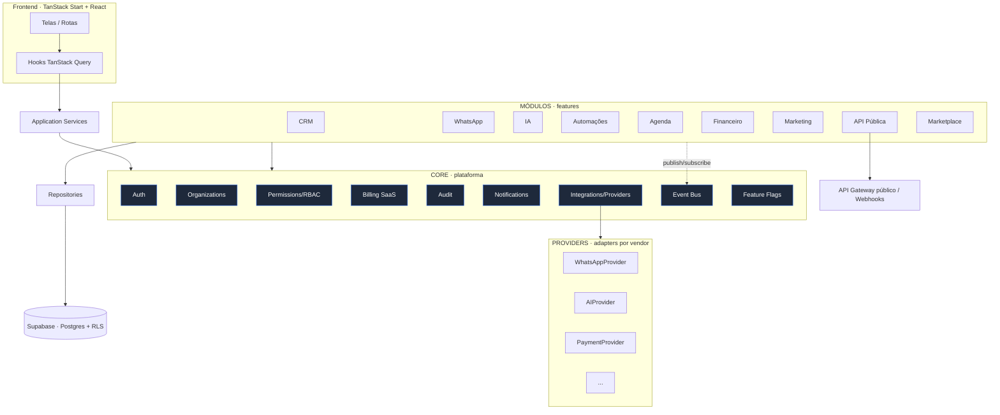
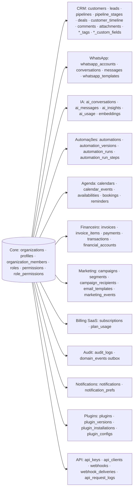
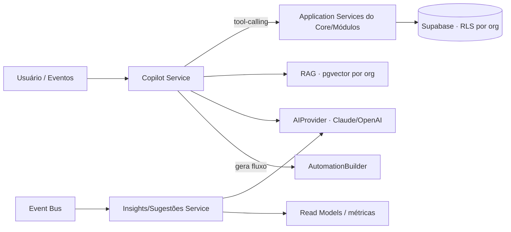

# Arquitetura Global da Plataforma — ConnectWeb Automations

> Documento de arquitetura para as fases F3–F10. **Sem código** — define
> contratos, limites e padrões para evitar retrabalho. Estende
> `ARCHITECTURE.md`, `DATABASE.md` e `core/README.md`.

## Princípios invioláveis (recap)

1. **Multi-tenant por RLS** — toda tabela de negócio tem `organization_id`; a org
   ativa vem sempre da sessão (nunca do cliente).
2. **Camadas:** `UI → Hooks → Application Services → Repositories → Supabase`.
   Domínio só regras; repositório só persistência.
3. **Módulos consomem o Core, nunca outro módulo.** Comunicação entre domínios
   **só via Event Bus**.
4. **Integrações externas só via Provider Interface** (nunca vendor direto).
5. **Feature flags + RBAC** gateiam toda funcionalidade.
6. **Plugin-ready:** módulos instaláveis/removíveis sem tocar o Core.

---

## 1. Arquitetura Geral — Mapa da plataforma

**Responsabilidade das camadas**

| Camada | O que é | Regras |
| --- | --- | --- |
| **Frontend** | Rotas (thin) + Hooks (TanStack Query) | UI nunca fala com repositório |
| **Core** | Auth, Organizations, Permissions, Billing(SaaS), Audit, Notifications, Integrations, Event Bus, Feature Flags | Não conhece nenhum módulo |
| **Módulos** | CRM, WhatsApp, IA, Automações, Agenda, Financeiro, Marketing, API Pública, Marketplace | Consomem só o Core; entre si, só via Event Bus |
| **Providers** | Adapters por vendor atrás de interfaces | Trocáveis por config |
| **Banco** | Postgres (Supabase) multi-tenant + RLS + triggers de auditoria | Isolamento por `organization_id` |
| **APIs** | API Pública REST + Webhooks (in/out) + Realtime | OAuth/API keys, rate limit |

---

## 2. Roadmap (F3–F10)

| Fase | Módulo | Núcleo da entrega | Providers principais |
| --- | --- | --- | --- |
| **F3** | WhatsApp Cloud API | Inbox omnichannel, envio, templates, realtime | WhatsApp, Storage |
| **F4** | IA Copilot | Copilot, insights, sugestões, geração de fluxos | AI, Embedding |
| **F5** | Automações Visuais | Builder + engine de execução event-driven | (todos os providers como ações) |
| **F6** | Agenda | Agendamentos, disponibilidade, lembretes, sync | Calendar, Notification |
| **F7** | Financeiro | Faturas, recebíveis, fluxo de caixa, conciliação | Payment, ERP, Bank |
| **F8** | Marketing | Campanhas, segmentação, disparos, tracking | Email, SMS, WhatsApp |
| **F9** | API Pública | REST pública, API keys, webhooks out, rate limit | Webhook |
| **F10** | Marketplace de Plugins | Instalar/remover módulos e plugins de terceiros | Marketplace, Storage, Function |

### Especificação por módulo

Cada módulo segue o mesmo esqueleto: `features/<m>/{domain,application,infrastructure,hooks,components,routes}` + migrations namespaced + RLS por `organization_id` + eventos + feature flag `<m>`.

#### F3 · WhatsApp
| Aspecto | Definição |
| --- | --- |
| Entidades | `WhatsAppAccount`, `Conversation`, `Message`, `WhatsAppTemplate`, `ContactChannel` |
| Eventos | `whatsapp.message.received/sent/delivered/read/failed`, `whatsapp.conversation.opened/assigned/closed`, `whatsapp.template.approved/rejected` |
| Repositories | `ConversationRepository`, `MessageRepository`, `TemplateRepository`, `WhatsAppAccountRepository` |
| Services | `InboxApplicationService`, `MessagingApplicationService`, `TemplateApplicationService` |
| Providers | `WhatsAppProvider` (Meta Cloud / Evolution), `StorageProvider` (mídia) |
| Permissões | `whatsapp.read`, `whatsapp.send`, `whatsapp.assign`, `whatsapp.templates.manage` |
| Feature flag | `whatsapp` |
| Tabelas | `whatsapp_accounts`, `conversations`, `messages`, `whatsapp_templates` |
| RPCs | `assign_conversation`, `mark_conversation_read`, `inbox_counters` |
| Read models | `inbox_summary`, `whatsapp_metrics` |
| Integrações | Meta WhatsApp Cloud API (webhook + send), Evolution API (alt) |

#### F4 · IA Copilot
| Aspecto | Definição |
| --- | --- |
| Entidades | `AiConversation`, `AiMessage`, `AiInsight`, `AiUsage`, `PromptTemplate`, `Embedding` |
| Eventos | `ai.completion.requested/completed/failed`, `ai.insight.generated`, `ai.suggestion.created`, `ai.credits.consumed`, `ai.flow.generated` |
| Repositories | `AiUsageRepository`, `InsightRepository`, `AiConversationRepository`, `EmbeddingRepository` |
| Services | `CopilotApplicationService`, `InsightApplicationService`, `AiCreditsService`, `RagService` |
| Providers | `AIProvider` (Claude/OpenAI), `EmbeddingProvider` |
| Permissões | `ai.use`, `ai.insights.read`, `ai.admin` |
| Feature flag | `ia` |
| Tabelas | `ai_conversations`, `ai_messages`, `ai_insights`, `ai_usage`, `embeddings` (pgvector) |
| RPCs | `consume_credits`, `ai_usage_summary`, `match_embeddings` (vetorial) |
| Read models | `ai_usage_metrics`, `insights_feed` |
| Integrações | Anthropic (Claude, default), OpenAI; pgvector para RAG |

#### F5 · Automações
| Aspecto | Definição |
| --- | --- |
| Entidades | `Automation`, `AutomationVersion`, `AutomationNode`, `AutomationEdge`, `AutomationRun`, `RunStep`, `Trigger` |
| Eventos | `automation.created/updated/activated/deactivated`, `automation.run.started/completed/failed`, `automation.step.executed`, `automation.triggered` |
| Repositories | `AutomationRepository`, `AutomationRunRepository` |
| Services | `AutomationBuilderService`, `AutomationEngineService`, `TriggerRegistryService` |
| Providers | consome WhatsApp/AI/Email/SMS/Calendar como **nós de ação** |
| Permissões | `automacoes.read/write/execute/publish` |
| Feature flag | `automacoes` |
| Tabelas | `automations`, `automation_versions`, `automation_runs`, `automation_run_steps` |
| RPCs | `enqueue_automation_run`, `automation_metrics` |
| Read models | `automation_metrics`, `run_history` |
| Integrações | Event Bus (gatilhos) + fila assíncrona (Supabase Queues / pg-boss) para execução |

#### F6 · Agenda
| Aspecto | Definição |
| --- | --- |
| Entidades | `Calendar`, `CalendarEvent`, `Availability`, `Booking`, `Reminder` |
| Eventos | `calendar.event.created/updated/canceled`, `calendar.reminder.due`, `calendar.booking.created/canceled` |
| Repositories | `CalendarRepository`, `EventRepository`, `BookingRepository` |
| Services | `SchedulingApplicationService`, `AvailabilityService` |
| Providers | `CalendarProvider` (Google/Outlook), `NotificationProvider` |
| Permissões | `agenda.read/write/manage` |
| Feature flag | `agenda` |
| Tabelas | `calendars`, `calendar_events`, `availabilities`, `bookings`, `reminders` |
| RPCs | `check_availability`, `book_slot` |
| Read models | `agenda_view`, `upcoming_reminders` |
| Integrações | Google Calendar, Outlook, ICS |

#### F7 · Financeiro (finanças do cliente — distinto de Billing SaaS)
| Aspecto | Definição |
| --- | --- |
| Entidades | `Invoice`, `InvoiceItem`, `Payment`, `Transaction`, `FinancialAccount`, `Category` |
| Eventos | `finance.invoice.created/paid/overdue/canceled`, `finance.payment.received/refunded`, `finance.transaction.recorded` |
| Repositories | `InvoiceRepository`, `TransactionRepository`, `PaymentRepository` |
| Services | `InvoicingApplicationService`, `FinanceApplicationService`, `ReconciliationService` |
| Providers | `PaymentProvider` (Stripe/Mercado Pago/Pagar.me), `ERPProvider`, `BankProvider` (Open Finance) |
| Permissões | `financeiro.read/write/manage` |
| Feature flag | `financeiro` |
| Tabelas | `invoices`, `invoice_items`, `payments`, `transactions`, `financial_accounts`, `categories` |
| RPCs | `finance_summary`, `mark_invoice_paid`, `cashflow_projection` |
| Read models | `cashflow`, `receivables_aging`, `finance_dashboard` |
| Integrações | Gateways de pagamento, NF-e, Open Finance, ERPs |

#### F8 · Marketing
| Aspecto | Definição |
| --- | --- |
| Entidades | `Campaign`, `Segment`, `Audience`, `CampaignRecipient`, `EmailTemplate`, `MarketingEvent` |
| Eventos | `marketing.campaign.created/scheduled/sent`, `marketing.email.opened/clicked/bounced`, `marketing.segment.updated` |
| Repositories | `CampaignRepository`, `SegmentRepository` |
| Services | `CampaignApplicationService`, `SegmentationService` |
| Providers | `EmailProvider`, `SMSProvider`, `WhatsAppProvider` (broadcast) |
| Permissões | `marketing.read/write/send` |
| Feature flag | `marketing` |
| Tabelas | `campaigns`, `segments`, `campaign_recipients`, `email_templates`, `marketing_events` |
| RPCs | `build_segment`, `campaign_metrics` |
| Read models | `campaign_performance`, `marketing_funnel` |
| Integrações | Email/SMS/WhatsApp; tracking (pixels/links) |

#### F9 · API Pública
| Aspecto | Definição |
| --- | --- |
| Entidades | `ApiKey`, `ApiClient`, `Webhook`, `WebhookDelivery`, `ApiScope`, `RequestLog` |
| Eventos | `api.key.created/revoked`, `api.request.received`, `api.ratelimit.exceeded`, `webhook.delivered/failed/retried`, `integration.connected/disconnected` |
| Repositories | `ApiKeyRepository`, `WebhookRepository`, `RequestLogRepository` |
| Services | `ApiKeyApplicationService`, `WebhookDispatchService`, `PublicApiGateway` |
| Providers | `WebhookProvider` (entrega out) |
| Permissões | `api.manage`, `api.keys.manage`, `webhooks.manage` |
| Feature flag | `api_publica` |
| Tabelas | `api_keys`, `api_clients`, `webhooks`, `webhook_deliveries`, `api_request_logs`, `api_scopes` |
| RPCs | `rotate_api_key`, `verify_api_key` |
| Read models | `api_usage_metrics`, `webhook_delivery_stats` |
| Integrações | OAuth2 (terceiros), OpenAPI spec, webhooks assinados (HMAC) |

#### F10 · Marketplace de Plugins
| Aspecto | Definição |
| --- | --- |
| Entidades | `Plugin`, `PluginVersion`, `PluginInstallation`, `PluginConfig`, `PluginEventSub` |
| Eventos | `plugin.published/installed/uninstalled/enabled/disabled/updated`, `plugin.config.changed` |
| Repositories | `PluginRepository`, `InstallationRepository` |
| Services | `MarketplaceApplicationService`, `PluginRuntimeService`, `PluginSandboxService` |
| Providers | `MarketplaceProvider`, `StorageProvider` (bundles), `FunctionProvider` (execução sandboxed) |
| Permissões | `plugins.install`, `plugins.manage`, `plugins.publish` |
| Feature flag | `marketplace` |
| Tabelas | `plugins`, `plugin_versions`, `plugin_installations`, `plugin_configs`, `plugin_event_subs` |
| RPCs | `install_plugin`, `uninstall_plugin`, `toggle_plugin` |
| Read models | `installed_plugins`, `marketplace_catalog` |
| Integrações | Registro de plugins, runtime sandbox (Edge Functions/WASM), assinaturas no Event Bus |

---

## 3. Event Bus — Catálogo completo de eventos

Convenção: `dominio.entidade.acao`, todos multi-tenant (`organizationId` no payload). O Core `audit` e `notifications` são **assinantes universais** (`subscribeAll`).

| Namespace | Eventos |
| --- | --- |
| `organization.*` / `member.*` | `organization.created/updated/deleted`, `member.invited/joined/removed`, `member.role.changed`, `user.invited` |
| `customer.*` / `lead.*` / `deal.*` | (F2) `customer.created/updated`, `lead.created/qualified/converted/lost`, `deal.created/stage.changed/won/lost` |
| `whatsapp.*` | `message.received/sent/delivered/read/failed`, `conversation.opened/assigned/closed`, `template.approved/rejected` |
| `ai.*` | `completion.requested/completed/failed`, `insight.generated`, `suggestion.created`, `credits.consumed`, `flow.generated` |
| `automation.*` | `created/updated/activated/deactivated`, `run.started/completed/failed`, `step.executed`, `triggered` |
| `calendar.*` | `event.created/updated/canceled`, `reminder.due`, `booking.created/canceled` |
| `finance.*` | `invoice.created/paid/overdue/canceled`, `payment.received/refunded`, `transaction.recorded` |
| `billing.*` (SaaS) | `subscription.created/updated/canceled`, `plan.changed`, `usage.recorded`, `trial.ending`, `invoice.paid` |
| `marketing.*` | `campaign.created/scheduled/sent`, `email.opened/clicked/bounced`, `segment.updated` |
| `api.*` / `webhook.*` | `api.key.created/revoked`, `api.request.received`, `api.ratelimit.exceeded`, `webhook.delivered/failed/retried` |
| `integration.*` | `connected/disconnected`, `sync.started/completed/failed` |
| `notification.*` | `created/sent/read`, `channel.push/email/inapp` |
| `plugin.*` | `published/installed/uninstalled/enabled/disabled/updated`, `config.changed` |
| `storage.*` | `file.uploaded/deleted` |

**Evolução do barramento:** F1 = in-memory. F3+ = **durável** via padrão **outbox** (tabela `domain_events`) → fila (Supabase Queues / pg-boss) → entrega + Supabase Realtime para push ao cliente. Interface `EventBus` permanece igual.

---

## 4. Provider Interfaces (contratos futuros)

Todas atrás de `core/integrations/providers`, resolvidas por `registry` + `config/providers.ts` (vendor por capability). Métodos multi-tenant.

| Interface | Capability | Vendors (troca sem alterar módulos) |
| --- | --- | --- |
| `WhatsAppProvider` | mensagens WhatsApp | Meta Cloud API ↔ Evolution API |
| `AIProvider` | LLM completions/tools | Claude ↔ OpenAI ↔ Gemini |
| `EmbeddingProvider` | vetores (RAG) | Anthropic/OpenAI/Voyage |
| `CalendarProvider` | agenda/sync | Google ↔ Outlook |
| `PaymentProvider` | cobrança | Stripe ↔ Mercado Pago ↔ Pagar.me |
| `EmailProvider` | e-mail transacional/marketing | Resend ↔ SendGrid |
| `SMSProvider` | SMS | Twilio ↔ Zenvia |
| `StorageProvider` | arquivos/mídia | Supabase Storage ↔ S3 |
| `OCRProvider` | extração de documentos | Textract ↔ Google Vision |
| `VoiceProvider` | STT/TTS | Whisper/ElevenLabs |
| `MapsProvider` | geocoding/rotas | Google Maps ↔ Mapbox |
| `ERPProvider` | integração ERP | Omie/Bling/Tiny |
| `MarketplaceProvider` | registro/instalação de plugins | interno |
| `WebhookProvider` | entrega de webhooks out | interno + assinatura HMAC |
| `NotificationProvider` | push/in-app | interno + FCM/APNs |
| `BankProvider` | Open Finance/conciliação | Pluggy/Belvo |

---

## 5. Banco de Dados — Mapa por domínio

Estratégia: **um único schema `public`** (PostgREST-friendly) com **prefixo por domínio** e **RLS por `organization_id`** em toda tabela. Todas as tabelas de negócio referenciam `organizations(id)`. Tabelas grandes (`messages`, `audit_logs`, `automation_run_steps`, `api_request_logs`, `embeddings`) são candidatas a **particionamento** (por org/tempo).

Regras transversais: UUID PK · `created_at`/`updated_at` · `deleted_at` (soft delete) onde faz sentido · trigger `audit_row_change` em toda tabela de negócio · códigos legíveis via `org_sequences`.

---

## 6. Arquitetura de Plugins (instalar/remover sem tocar o Core)

- **Registro:** `config/modules.ts` (interno) + tabela `plugins`/`plugin_installations` (marketplace). `Organization.enabledModules` liga/desliga por tenant.
- **Isolamento de código:** cada módulo é auto-contido (`domain/application/infrastructure/hooks/routes`) e só depende de `@/core`. Remover = remover a pasta + desabilitar a flag; o Core não muda.
- **Contrato de plugin (manifesto):** `key`, `version`, `permissions[]`, `events.produces[]`, `events.consumes[]`, `routes[]`, `migrations[]`, `providers[]`.
- **Extensão via eventos:** plugins **assinam** eventos do Core/módulos e **publicam** os seus — sem chamada direta. Nenhum acoplamento de import.
- **UI dinâmica:** sidebar/rotas montadas a partir do registro de módulos habilitados.
- **Migrations namespaced:** cada módulo/plugin traz suas migrations com prefixo; RLS herdado do padrão `is_org_member`/`has_permission`.
- **Plugins de terceiros (F10):** executados em **sandbox** (Edge Functions/WASM) com escopo de permissões e cota; nunca acesso direto ao banco — só via API/Event Bus.

---

## 7. Escalabilidade (milhares de empresas)

| Vetor | Estratégia |
| --- | --- |
| **App** | Stateless em edge (Cloudflare Workers/Nitro) → escala horizontal automática |
| **Banco** | Postgres multi-tenant + **RLS**; **pooling** (Supavisor/PgBouncer); **read replicas** para read models/relatórios |
| **Tabelas quentes** | Particionamento de `messages`/`audit_logs`/`automation_run_steps`/`embeddings` por `organization_id` e/ou tempo |
| **Cache** | TanStack Query (cliente) + cache de edge + Redis/KV para read models e sessão |
| **Assíncrono** | Filas (Supabase Queues/pg-boss) para automações, webhooks, IA e disparos de marketing; padrão **outbox** para o Event Bus durável |
| **Rate limiting** | Por org/API key (F9); backpressure nas filas |
| **IA/custos** | Créditos por org (`ai_usage`), quotas por plano, batching de embeddings |
| **Observabilidade** | Logging estruturado (já abstraído) → Sentry/OpenTelemetry; métricas por tenant |
| **Extremo** | Caminho de **sharding por organização** (org → shard) mantendo o mesmo contrato de repositório |

---

## 8. Arquitetura de IA

- **Copilot:** conversa sobre os dados da org **via tool-calling** que chama os **Application Services** — logo, herda **RBAC + RLS** (a IA nunca burla o isolamento). Cota por `ai_usage`.
- **Insights & Sugestões:** reagem a eventos (`deal.won`, `lead.created`…) + read models → LLM resume/prioriza → "próxima melhor ação".
- **Análise de métricas:** LLM sobre `dashboard_metrics`/`reports_metrics` (mesma fonte da verdade dos gráficos).
- **Geração automática de fluxos:** LLM produz um grafo de automação → validado pelo `AutomationBuilderService` (nada é executado sem passar pelas regras do domínio).
- **RAG multi-tenant:** embeddings escopados por `organization_id` (RLS no `embeddings`); nunca cruzam tenants.
- **Providers:** `AIProvider`/`EmbeddingProvider` trocáveis (Claude default). Guardrails: PII, cota, isolamento, auditoria (`ai.*` no Event Bus + `audit_logs`).

---

## 9. Convenções que todo módulo herda

Segurança (RLS + RBAC + Feature Flags) · multi-tenant (`organization_id` + sessão) · Event Bus (comunicação entre domínios) · Provider Interface (integrações) · Application Services (API interna) · Repositories persist-only · TanStack Query (cache/optimistic/invalidation) · erros/log padronizados (`core/errors`, `core/logging`) · auditoria automática por trigger.

> **Próximo passo:** aprovação desta arquitetura → início da **F3 (WhatsApp Cloud API)**, seguindo exatamente estes contratos.
